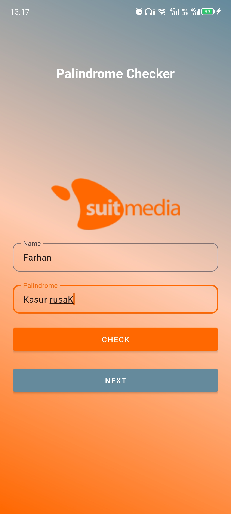
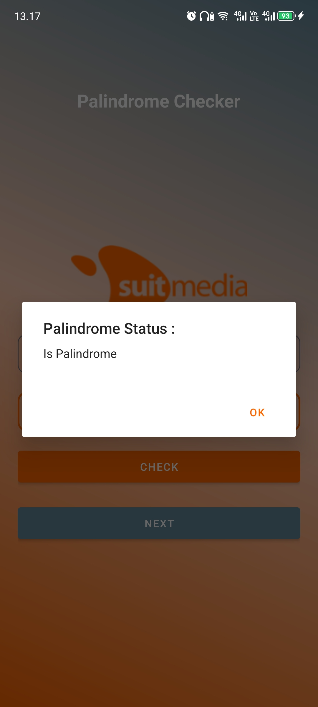
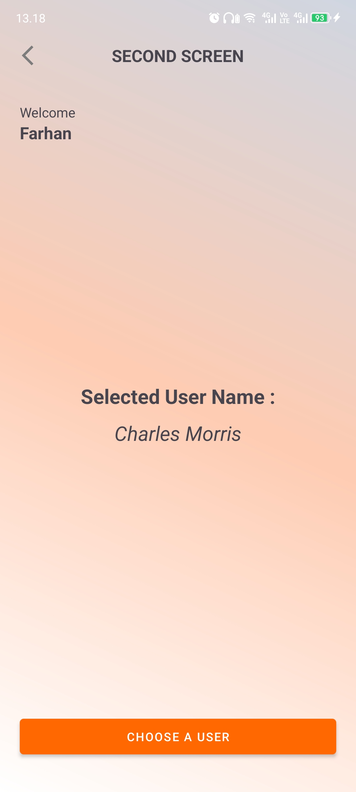

# Palindrome Checker

## Overview

**Palindrome Checker** is a mobile application designed to check whether a given word is a palindrome and manage user names. Built with Kotlin and XML, this app utilizes the ReqRes API to fetch a list of users and display detailed user information. The app supports devices running Android SDK 21 and above, with a target SDK of 34.

## Features

- **Palindrome Check**: Input a word into an `EditText` to determine if it's a palindrome.
- **User Name Input**: Enter a user name which will be displayed in the next activity.
- **User List**: Fetch and display a list of users from the ReqRes API using a `RecyclerView`.
- **Selected User**: Show the name of the selected user from the user list.

## API Reference

The application uses the [ReqRes API](https://reqres.in/) to fetch user data. The API provides endpoints for retrieving a list of users which is displayed in the app.

## Development Environment

- **Language**: Kotlin
- **UI**: XML
- **Minimum SDK**: 21
- **Target SDK**: 34

## Usage

1. **Palindrome Check**:
    - Enter a word into the `EditText` field.
    - The app will display whether the entered word is a palindrome or not.

2. **User Name Input**:
    - Enter a user name in the provided field.
    - Navigate to the next activity to see the entered user name displayed.

3. **User List**:
    - View a list of usernames fetched from the ReqRes API.
    - The list is displayed using a `RecyclerView`.

4. **Selected User**:
    - Select a user from the list to see their name displayed in the next activity.

## Demo

### Screenshots

| Screen            | Description                               | Demo Photo                                                                 |
|-------------------|-------------------------------------------|----------------------------------------------------------------------------|
| Home Screen       | Input field for palindrome check and user name |                    |
| Palindrome Result | Shows the result of palindrome check      |  |
| Third Screen      | Displays list of users from ReqRes API     |                 |
| Second Screen     | Shows details of selected user             |         |

### Video Demo

- Watch the demo video here: [Video Demo](https://drive.google.com/file/d/1wJvCXDIlBX73gemfywPRTc9j2bwhY3U7/view?usp=sharing)

## Installation

1. Clone the repository:
   ```bash
   https://github.com/farhanfath/palindrome-checker.git

2. Open the project in Android Studio.
   Build and run the application on your emulator or device.

3. Contributing

   Contributions are welcome! Please submit issues and pull requests on the GitHub repository.